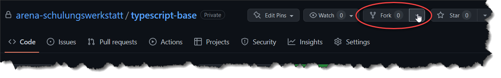

# Aufgabe 01

## Ziele

* Schaffung der Voraussetzung für die aktive Teilnahme an der Schulungswerkstatt
* Installation der benötigten Tools
* Erste Verprobung der zu nutzenden Tools durch lösen von Aufgaben
* Werkstatt-Workflow verproben

### Checkliste der erledigten Aufgaben

- [ ] Aufgabe 1 - Github-Account exists
- [ ] Aufgabe 2 - fork, clone, change, commit, push
- [ ] Aufgabe 3 - NPM ready
- [ ] Aufgabe 4 - TypeScript ready

## Aufgabenstellungen

### Aufgabe #1 - Github-Account anlegen
* Erzeuge, sofern noch nicht vorhanden, einen Github-Account. [Github signup](https://github.com/signup?ref_cta=Sign+up&ref_loc=header+logged+out&ref_page=%2F&source=header-home)

### Aufgabe #2 - Git preparation
* Log dich mit deinem Benutzer auf Github ein.
* Wechsel in das [Schulungs-Projekt](https://github.com/arena-schulungswerkstatt/typescript-base)
* Klicke oben rechts auf ``Fork``
 
* Clone das ``geforkte`` Repo auf deinen Rechner -> [Wie geht das?](clone-repo.md)
* setze den Hacken in dieser ``aufgabe.md`` für ``Aufgabe #1`` für ``Aufgabe #2``

Suche die folgende Zeile und setze ein ```x``` in die eckigen Klammern [ ]:
````shell
- [ ] Aufgabe 1 - Github-Account exists
- [ ] Aufgabe 2 - fork, clone, change, commit, push
````
zu
````shell
- [x] Aufgabe 1 - Github-Account exists
- [x] Aufgabe 2 - fork, clone, change, commit, push
````
* ``commit & push`` deiner Änderung 

### Aufgabe #3 - NPM ready
* Lade node.js (LTS) herunter -> https://nodejs.org/de/
* [Installationsbeschreibung für Windows](https://treehouse.github.io/installation-guides/windows/node-windows.html)

#### Prüfen ob node.js und npm funktioniert 
```shell
node -v
npm -v
```
Suche die folgende Zeile und setze ein ```x``` in die eckigen Klammern [ ]:
````shell
- [ ] Aufgabe 3 - NPM ready
````
zu
````shell
- [x] Aufgabe 3 - NPM ready
````
* ``commit & push`` deiner Änderung 

### Aufgabe #4 - TypeScript ready
* Wechsle in das ``01`` Verzeichnis (``/typescript-base/01``)
* Führe folgenden Befehl aus um ein NPM-Projekt zu erstellen

```shell
$ npm init
This utility will walk you through creating a package.json file.
It only covers the most common items, and tries to guess sensible defaults.

See `npm help init` for definitive documentation on these fields
and exactly what they do.

Use `npm install <pkg>` afterwards to install a package and
save it as a dependency in the package.json file.

Press ^C at any time to quit.
package name: (01) first
version: (1.0.0) 
description: 
entry point: (index.js) 
test command: 
git repository: 
keywords: 
author: 
license: (ISC) 
About to write to /home/padawan/git/arena/schulungswerkstatt/typescript-base/01/package.json:

{
  "name": "first",
  "version": "1.0.0",
  "description": "",
  "main": "index.ts",
  "scripts": {
    "test": "echo \"Error: no test specified\" && exit 1"
  },
  "author": "",
  "license": "ISC"
}


Is this OK? (yes) yes
```

Anschließend wurde im ``01` Verzeichnis eine ``package.json`` erzeugt

* Führe folgenden Befehl aus um Typescript als dev-dependency zu installieren.

````shell
npm install typescript --save-dev
````
* 
* Installiere Typescript global so das der Typescript-Compile zur Verfügung steht

````shell
npm install -g typescript
````

* erzeuge eine ``index.ts`` Datei mit folgendem Inhalt im ``01`` Ordner

```typescript
function addNumbers(a: number, b: number) { 
    return a + b; 
} 

var sum: number = addNumbers(10, 15) 

console.log('Sum of the two numbers is: ' +sum); 
```

* Führe ``tsc index.ts`` aus um das Typescript in Javascript zu übersetzen

Führe das index.js wie folgt aus:
```shell
node index.js

Sum of the two numbers is: 25
```

Suche die folgende Zeile und setze ein ```x``` in die eckigen Klammern [ ]:
````shell
- [ ] Aufgabe 4 - TypeScript ready
````
zu
````shell
- [x] Aufgabe 4 - TypeScript ready
````
* ``commit & push`` deiner Änderung 