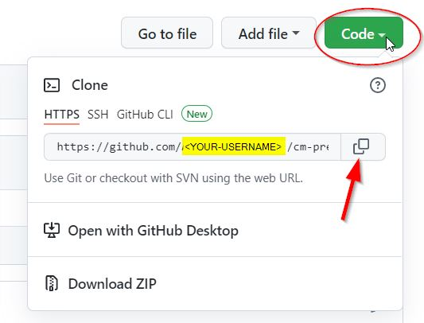
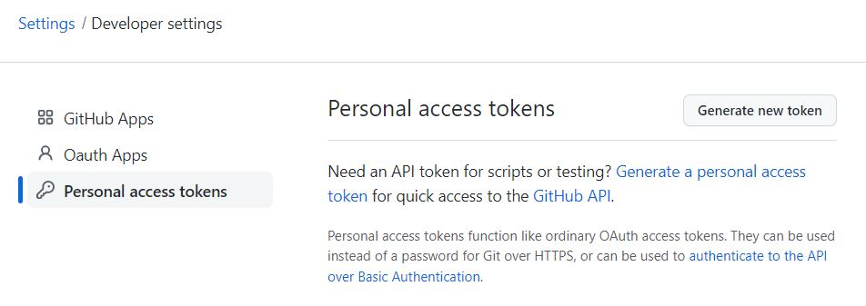
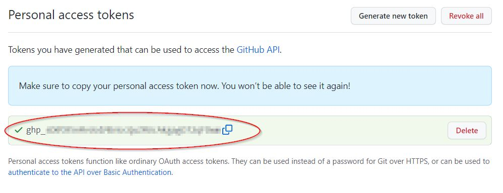
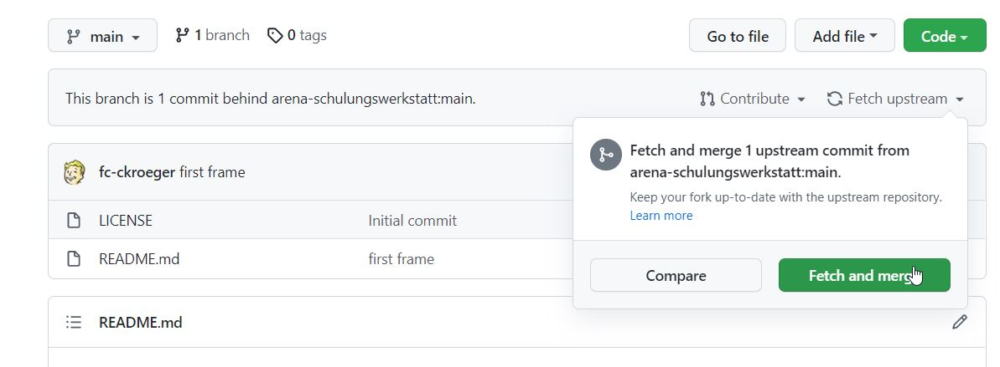

# Clonen eines Git-Repositories

An dieser Stelle sollen zwei Möglichekeiten dargestellt werden, per ``command-console`` und aus ``IntelliJ``.

Grundsätzlich sollte man nicht scheuen die Konsolen-Befehle zu kennen, denn nicht alle Operationen sind aus der 
IDE erreichbar. Voraussetzung ist das ein Git-Client auf dem lokalen Entwicklungsrechner installiert und 
konfiguriert ist.

* [Beschreibung der Installation](https://git-scm.com/book/de/v2/Erste-Schritte-Git-installieren)
* [Erste Schritte - Git Basis-Konfiguration](https://git-scm.com/book/de/v2/Erste-Schritte-Git-Basis-Konfiguration)

## Clonen aus der ``command-console``

* Zunächst kopiert man sich die Repo-URL.
 

* Anschließend öffnet man die ``console`` im gewünschten loklen Pfad z.B. ``c:/git/arena`` 
* Mit folgendem Befehl clont man das Repository auf den eigenen Rechner: 
 
     ``git clone https://github.com/<YOUR-USERNAME>/typescript-base.git``
 
    (``<YOUR_USERNAME>`` durch eigenen Github-Namen ersetzen)
* Beim ersten Clonen fragt Github nach den Github-Login-Daten.

````shell
padawan@typewriter:~$ git clone https://github.com/padawan/typescript-base.git
Cloning into 'typescript-base'...
Username for 'https://github.com':
````
Github lässt kein Login über die zuvor vergebenen Zugangsdaten (Username+Passwort) zu. Um ein Login durchzuführen muss 
man zunächst in Github ein Personal-Access-Token generieren.

Über Settings / Devloper setting / Personal access token kann eines erstellt werden:




* Um Änderungen wie updates zu erhalten, empfiehlt es sich ein weiteres Remote-Repo zu konfigurieren.

  Ins Verzeichnis ``typescript-base`` wechseln und folgendes ``command`` ausführen:
````shell
git remote add arena https://github.com/arena-schulungswerkstatt/typescript-base.git
````
Sollte es updates im Ursprungs-Repository geben, so kann man das in der Github-Oberfläche sehen.

