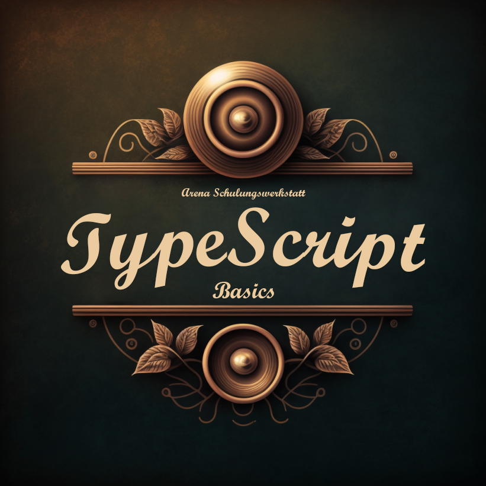

# TypeScript Basics

## Ziele

* Erlernen der TypeScript-Basics im Selbststudium
* Sprache lernen mittels 
  * kleiner Aufgaben
  * Quizfragen
* Kennenlernen
  * Projekt-Setup
  * Tooling
  * Quellen

## Aufgaben

* [01 - Forke und erstelle ein Projekt](01/aufgabe.md)
* 02 - ...

## Quizfragen

* [Hier geht es zu den Quizfragen](/quiz/quiz.md)

## Quellen

* Webseiten
  * [typescriptlang.org](https://www.typescriptlang.org/)
  * [TypeScript Cheat Sheets](https://www.typescriptlang.org/cheatsheets)
  * [TypeScript Deep Dive](https://basarat.gitbook.io/typescript/getting-started)

* Videos
  * [TypeScript in 4 Minuten](https://www.youtube.com/watch?v=ouzj1nHx2pg)
  * [TypeScript lernen: Eine Einführung in 80 Minuten // deutsch](https://youtu.be/_CaGUZNEobk)
    * Der Abschnitt über Klassen kann vernachlässigt werden
  * [TypeScript Tutorial for Beginners \[2022\] // englisch](https://youtu.be/d56mG7DezGs)
